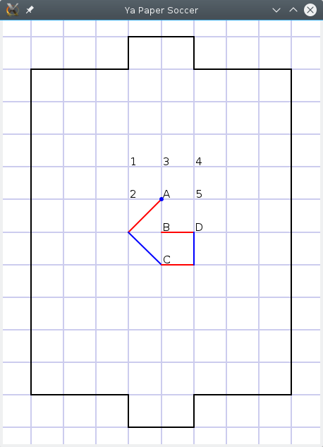
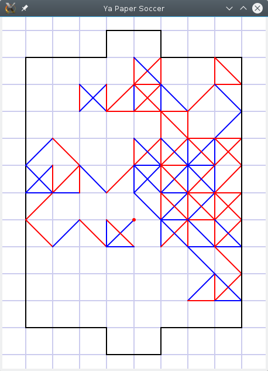

# Piłkarzyki

Piłkarzyki (na kartce) - gra na kartce w kratkę dla dwóch osób. Celem gry jest poprowadzenie piłki (punktu) do bramki przeciwnika lub zablokowanie/uniemożliwienie mu wykonania ruchów. Piłkarzyki jakie są każdy widzi - więcej info na [wikipedii][wiki].

### Ya Piłkarzyki

Jest to gra na Androida dostępna w [Google Play][yapapersoccer] Ograniczony kod źródłowy (tylko gracz pojedynczy, AI, benchmark) jest dostępny w tym repozytorium. Pisząc kod na początku nie miałem na myśli go udostępniać, tylko pod koniec nieco go posprzątałem, więc proszę nie bić jak coś jest w kodzie niejasne czy wręcz głupie.

# Trochę teorii

To o czym tutaj napiszę to strumień myśli, doświadczenia, które zebrałem pisząc sztuczną inteligencję do piłkarzyków. Ya Piłkarzyki wykorzystuje stary dobry [min-max][minmax] oraz oczywiście [alpha-beta][alphabeta]. Zakładam, że te algorytmy są nieco znane i rozumiane.

Czym jest ruch? Ruchem nazywam to, co w danej chwili może wykonać gracz. W piłkarzykach można odbijać się od narysowanych kresek i zyskać kika 'ruchów'. Jednak ja ruchem nazywam tę sekwencję kresek, którą wykona dany gracz w swojej turze, czyli ruch może się składać z jednej kreski albo nawet przejść przez całe boisko wykorzystując kilkanaście kresek. Będzie to jednocześnie wygodne do drzewa min-max, ponieważ taki ruch będzie w jednej turze, na jednym poziomie. Po angielsku nazywamy ply.

Kiedy jest koniec gry? Kiedy piłka znajdzie się w którejkolwiek bramce. Wtedy gracz, który ma w swojej bramce piłkę przegrywa. Koniec gry następuje również, kiedy gracz nie ma możliwości wykonania legalnego ruchu. Uznaję wtedy, że ten gracz przegrywa, choć niektórzy uważają, że wtedy jest remis bądź taki gracz traci tylko 0.5 punktu.

### Kilka liczb

Liczby będą dotyczyć standardowego boiska (8 x 10 kratek) bez linii połowy. Wynikają one z symulacji tysięcy gier AI vs AI i mogą być one obarczone błędem, więc nie traktować ich jako prawdy objawionej.

Nietrudno się domyślić, że na złożoność gry składa się ilość możliwych ruchów do wykonania w danej turze i głębokość na jaką przewidujemy swoje ruchy i odpowiedzi przeciwnika. Np. jeśli w danej grze zawsze (albo średnio) jest b możliwych ruchów, a my przewidujemy d tur do przodu, otrzymujemy wtedy około b^d możliwości do rozpatrzenia. Szachy mają średnio 35 możliwych ruchów na turę, a przewidując 6 tur* do przodu (*ściślej to 3 tury, jako że w szachach na jedną turę składa się gra białych i odpowiedź czarnych) otrzymujemy około 35^6 możliwości do rozpatrzenia czyli prawie 2 miliardy używając zwykłego min-max. Oczywiście dzięki usprawnieniom takim jak alpha-beta wystarczy przeanalizować znacznie mniej ruchów, by osiągnąć te same rezultaty co przy zwykłym min-max. Jak sprawa ma się przy piłkarzykach?

Trzeba sobie zadać pytanie jak liczyć ruchy. Spójrzmy na poniższy obrazek:

W piłkarzykach nie jest ważna kolejność, a zajęte kreski. W tym wypadku pewne ruchy się powtarzają. Np. ruch ABCDA2 i ADCBA2 są takie same (mają te same kreski), więc bez sensu jest je obydwie analizować. Trochę zajęło mi zaimplementowanie algorytmu, który by nie powtarzał tych ruchów... Uznaję, że na powyższym rysunku gracz ma 52 możliwe ruchy do wykonania. Nie liczę powtarzających się ruchów, co by dało razem 57 możliwości.

Na standardowym boisku jest 80 wolnych punktów, zatem maksymalna głębokość drzewa gry wynosi 81. Przy pierwszej turze jest 8 możliwości. Przy drugiej 7 możliwości. Potem w zależności jest odpowiednio 7 albo 12. Następnie gra może potoczyć się różnymi ścieżkami z różnymi możliwościami. Jaka jest zatem średnia ilość możliwych ruchów na turę w piłkarzykach?

Aby odpowiedzieć na pytanie jaka jest średnia ilość możliwych ruchów na na turę, zaprojektowałem specjalne AI do tego celu. Przeprowadziłem symulacje tysięcy gier AI vs AI. Taki AI wyliczał tylko swoje ruchy bez odpowiedzi przeciwnika oraz nie posiadał ogranicznika, który występuje w kodzie w repozytorium. Zanim odpowiem na powyższe pytanie, napiszę maksymalną ilość możliwości na jaką napotkałem w tych symulacjach: 433'647. Ponad 400 tysięcy niepowtarzających się ruchów w obrębie tury jednego gracza!. Oto ta sytuacja:

Aby dojść do tej sytuacji na boisku, w notacji 'kurnikowej'(?) jest to: 13064113570225017036575014630745741422243523574227742164435274617703502106741745431672745757134661453130361. (notacja: 0 - do góry, 1 - w górny prawy róg, 2 - w prawo itd.). Z kolei wszystkie możliwe ruchy wypisane są w tym [pliku](papersoccer02_possible_moves). Możliwe, że jednak jest błąd i są tam powtarzające się ruchy.

Wnioski po rozegraniu 100'000 gier: Średnia ilość możliwych ruchów na gracza wynosi ok. 62, odchylenie standardowe ok 202.5. W grze napotkanie setek możliwości nie należy do rzadkości, czasami można trafić i ponad tysiąc możliwości, a w skrajnych przypadkach ponad kilkadziesiąt tysięcy. W piłkarzykach jest to o tyle ciekawe, że duża ilość możliwości prowadzi do większej możliwości odpowiedzi, co bardzo mocno zwiększa drzewo gry. Dlatego też w kodzie dałem ogranicznik na ilość możliwych ruchów w turze.

# Strategia

Najprostszą strategią jest dążenie do bramki przeciwnika, oczywiście starając się nie przegrać. Zdaje to egzamin i komputer gra w miarę przyzwoicie.

Po wykonaniu ruchu obliczamy jego wartość (funkcja heurystyczna). Funkcja obliczająca wartość gry jest następująca:
- jeśli znajduję się w bramce przeciwnika, wygrałem i jest wartość najwyższa. MAX = 500
- jeśli odciąłem drogę do mojej bramki, wartość bardzo wysoka. MAXB = 480
- jeśli przeciwnik odciął mi drogę do jego bramki, wartość bardzo niska. MINOB = -440
- jeśli z tej pozycji można trafić do mojej bramki, praktycznie przegrałem i wartość prawie najniższa. MIN = -460
- jeśli znajduję się w swojej bramce, przegrałem i wartość prawie najniższa. MING = -480
- jeśli koniec, nie ma możliwości legalnego ruchu (np. róg boiska), przegrałem i wartość najniższa. MINB = -500
- w przeciwnym wypadku wartość to odległość od mojej bramki. odległość czyli y (iksów nie liczę)

Osobiście uważam, że lepiej sobie strzelić samobója :) niż dojść do sytuacji, w której przeciwnik uniemożliwi mi wykonanie legalnego ruchu. Bawiłem się trochę tym wyliczaniem odległości od bramki, np. też uwzględniając odleglość x, ale wyszło mi, że nie ma większej różnicy w wygranych/przegranych, ale szybkość jest minimalnie większa. Taka funkcja nie uwzględnia jednak rzeczywistych odległości, którę mogą być większe lub mniejsze ze względu na odbicia. Generalnie jeśli komputer może nas odciąć od swojej bramki, to na 99% to zrobi. Tak samo na 99% nie da sobie odciąć drogi do naszej bramki. Te 99% wynika z ogranicznika ilości ruchów do sprawdzenia na poziom.

Grając z ludźmi na kurniku, ci lepsi prawie zawsze cofali się do swojej bramki. Pomyślałem, że tak jest lepiej ze względów psychologicznych, ale postanowiłem to wypróbować. Zamieniłem powyższą funkcję, żeby po prostu wyliczała dużą wartość kiedy jestem bliżej swojej bramki. Po takiej modyfikacji zrobiłem symulacje normalny vs cofacz. Największym zdumieniem było to, że obaj gracze, gdy mają ten sam ogranicznik i głębokość drzewa, w tym wypadku cofacz wygrywa od 2 do 5 razy więcej niż przegrywa! Długo wtedy sprawdzałem czy gdzieś nie popełniłem błędów przy przeliczaniu wygranych itp. Błędów poważniejszych wtedy nie znalazłem. Sam postanowiłem zagrać cofając. Rzeczywiście częściej wygrywałem. Czasami też dużo przegrywałem, bo nie zauważyłem, że można jednym ruchem strzelić mi bramkę. Z drugiej stony komputer takiego błędu by nie popełnił.

W jednym z wcześniejszych wersji Ya Piłkarzyków najtrudniejszy i prawie najtrudniejszy poziom różniły się tylko tym, że jeden się cofał, a drugi parł do przodu. Teraz poziom trudny także się cofa, ale patrzy głębiej oraz wykorzystuję tu iterative deepening (a przynajmniej próbuję).

# Kod i implementacja

Skrócony opis jak to działa.

Boisko zaimplementowałem za pomocą grafu nieskierowanego. Uznałem, że graf byłby tu najbardziej naturalny. Przecięcia linii to wierzchołki grafu. Jak się poruszamy to łączymy te wierzchołki. Każdy wierzchołek ma do 8 sąsiadów. Wierzchołków jest (szerokość + 1) * (wysokość + 1) + 6, czyli dla boiska 8 x 10 jest to 9 * 11 + 6 = 105 wierzchołków.

Sam graf został zaimplementowany jako macierz sąsiedztwa i lista sąsiedztwa. Takie rozwiązanie może i wymaga więcej pamięci (ale boisko nie jest takie duże...), to ułatwia wiele operacji zyskać złożoność O(1). Generalnie szybkość wyliczania ruchów zależy od szybkości manipulacji grafem. Na moim telefonie (LG L9 II / LG D605) szybkość wynosi około 100'000 ruchów na sekundę.

Wyliczenie każdego ruchu to wariant przeszukiwania w głąb i domieszki przeszukiwania wszerz, z pamięcią części wcześniej odwiedzonych dróg co by uniknąć ponownego przeliczania cykli, a zatem powtarzających się ruchów z różną kolejnością (te 400 tysięcy spokojnie urosłoby do ponad miliardów). Wybiera sąsiadów losowo, żeby w ramach ogranicznika sprawdzić jak największą rożnorodność ruchów. Stwierdzenie, czy w danym ruchu przeciwnik może strzelić w 1 ruchu bramkę jest trywialne. Stosunkowo łatwe jest sprawdzenie też czy zablokowaliśmy przeciwnika do naszej bramki, albo czy przeciwnik odciął drogę do jego bramki, choć tutaj dałoby radę inteligentniej to zrobić i jakoś zapamiętać.

Algorytm zaimplementowany w telefonie ma następujące ograniczenia:
- bardzo łatwy - głębokość 1, limit 20, dodatkowe ograniczenia
- łatwy - głębokość 1, limit 30, dodatkowe ograniczenia
- normalny - głębokość 1+, limit 100, sprawdza odcięcie od bramek
- zaawansowany - głębokość 2+, limit 200, sprawdza odcięcie od bramek
- trudny - cofacz, głębokość do 3+ (iterative deepening, max 10 sekund na myślenie), limit 200, sprawdza odcięcie od bramek

Limit to maksymalna ilość ruchów dla danego poziomu. Czyli normalny sprawdzi do 100 ruchów. Głębokość oznacza głębokość drzewa gry. Np. głębokość 1 oznacza tylko nasze ruchy, głębokość 2 oznacza nasze ruchy i odpowiedź przeciwnika. Głębokość + oznacza, że dla sytuacji podbramkowej sprawdzi dodatkowo odpowiedź przeciwnika. Takie mini-rozwiązanie [problemu horyzontu][horizon].

Samo AI napisane w C++. Na telefonach jest wtedy kilkanaście razy szybciej, na PC ok. 2-3x szybciej w porównaniu do czystej javy.

   [minmax]: <https://pl.wikipedia.org/wiki/Algorytm_min-max>
   [alphabeta]: <https://pl.wikipedia.org/wiki/Algorytm_alfa-beta>
   [yapapersoccer]: <https://play.google.com/store/apps/details?id=pl.derjack.papersoccer>
   [wiki]: <https://pl.wikipedia.org/wiki/Pi%C5%82karzyki_na_kartce>
   [horizon]: <https://en.wikipedia.org/wiki/Horizon_effect>
